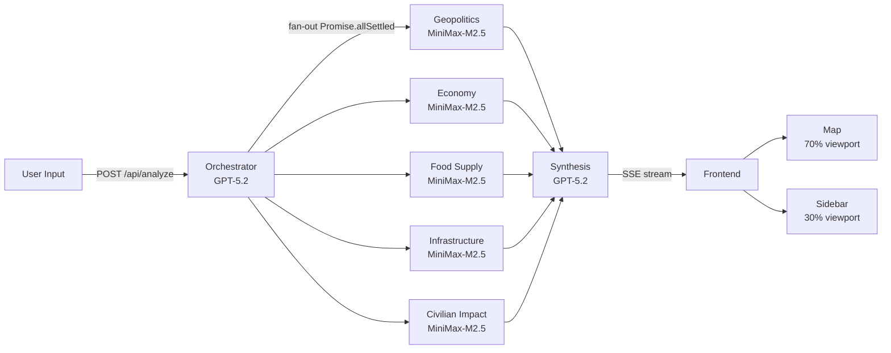

# CryoNexus — MVP Specification

## 0. Preamble

**Multi-Agent Catastrophic Risk Simulation Platform**

> A web application where users describe hypothetical catastrophic scenarios in natural language and watch 5 specialized AI agents analyze cascading impacts across geopolitics, economy, food systems, infrastructure, and civilian welfare — all visualized on a real-time interactive map with streaming results.

| Constraint | Value |
|---|---|
| Build time | 48 hours, feature-freeze at hour 30 |
| Team | 3–4 developers |
| Target judges | Engineering leaders at Snowflake (data architecture, streaming pipelines, systems thinking) |
| Deployment | Live demo on Vercel (single `git push`) |
| API budget | ~$50–100 total |
| Stack | Full TypeScript — Next.js 15, Vercel AI SDK, MapLibre + deck.gl |
| Orchestrator + Synthesis model | GPT-5.2 (`gpt-5.2`) via `@ai-sdk/openai` — $1.75/$14 per M tokens |
| 5 Specialist agents model | MiniMax-M2.5 (`MiniMax-M2.5`) via `@ai-sdk/openai-compatible` (base URL `https://api.minimax.io/v1`) |
| MCP | Out of scope — direct tool definitions only |

---

## 1. System Architecture

### Data Flow



### UI Layout

```
┌──────────────────────────────────────────────────────────────────────┐
│  CryoNexus                          Risk Score: ██ 73    Immediate  │
├───────────────────────────────────────────┬──────────────────────────┤
│                                           │ ┌──────────────────────┐ │
│                                           │ │ Scenario Input       │ │
│                                           │ │ [textarea]  [Analyze]│ │
│           MapLibre + deck.gl              │ │ [Suez] [Texas] [Ice] │ │
│              70% width                    │ ├──────────────────────┤ │
│                                           │ │ Geo│Econ│Food│Infr│Civ│ │
│                                           │ │ ● streaming text...  │ │
│                                           │ │                      │ │
│                                           │ ├──────────────────────┤ │
│  [Layer toggles]            [Legend]       │ │ Synthesis Panel      │ │
└───────────────────────────────────────────┴──────────────────────────┘
```

### Project File Tree

```
cryonexus/
├── app/
│   ├── layout.tsx                 # Root layout: dark theme, Inter font
│   ├── page.tsx                   # Main page: 70/30 map + sidebar grid
│   ├── api/
│   │   └── analyze/
│   │       └── route.ts           # POST endpoint: SSE stream via ReadableStream
│   └── globals.css                # Tailwind v4 base + dark theme tokens
├── components/
│   ├── map/
│   │   ├── MapView.tsx            # MapLibre + DeckGL overlay integration
│   │   ├── layers/
│   │   │   ├── ChoroplethLayer.ts # GeoJsonLayer — country impact coloring
│   │   │   ├── ConflictLayer.ts   # ScatterplotLayer — pulsing red circles
│   │   │   ├── FoodDesertLayer.ts # GeoJsonLayer — orange food-insecure regions
│   │   │   ├── InfrastructureLayer.ts # ScatterplotLayer — outage zones
│   │   │   ├── TradeArcLayer.ts   # ArcLayer — trade/supply disruption arcs
│   │   │   ├── DisplacementArcLayer.ts # ArcLayer — blue displacement arcs
│   │   │   └── HeatmapLayer.ts    # HeatmapLayer — compound risk density
│   │   ├── MapControls.tsx        # Layer toggle buttons
│   │   └── MapLegend.tsx          # Color scale legend
│   ├── sidebar/
│   │   ├── ScenarioInput.tsx      # Textarea + submit + golden-path buttons
│   │   ├── AgentPanel.tsx         # Single agent streaming output
│   │   ├── AgentPanelGroup.tsx    # Tabbed container for 5 agents
│   │   ├── SynthesisPanel.tsx     # Synthesis output + risk score badge
│   │   └── RegionDetail.tsx       # Click-on-region detail with Recharts
│   └── ui/                        # shadcn/ui primitives (Button, Tabs, Badge, etc.)
├── lib/
│   ├── agents/
│   │   ├── orchestrator.ts        # generateObject() → OrchestratorOutput
│   │   ├── geopolitics-agent.ts   # streamText() + generateObject()
│   │   ├── economy-agent.ts
│   │   ├── food-supply-agent.ts
│   │   ├── infrastructure-agent.ts
│   │   ├── civilian-impact-agent.ts
│   │   ├── synthesis-agent.ts     # streamText() consuming all 5 outputs
│   │   ├── schemas.ts             # All 7 Zod schemas (single source of truth)
│   │   └── providers.ts           # OpenAI + MiniMax provider config
│   ├── data/
│   │   ├── loader.ts              # Load and parse all pre-loaded JSON datasets
│   │   ├── countries.json         # Natural Earth GeoJSON (110m, <2MB)
│   │   ├── power-plants.json      # WRI ~35,000 plants
│   │   ├── risk-index.json        # INFORM 191 countries
│   │   ├── economic-indicators.json # World Bank GDP, pop, poverty, etc.
│   │   └── displacement.json      # UNHCR refugee/IDP data
│   ├── gdelt.ts                   # GDELT DOC 2.0 API client
│   ├── risk-score.ts              # Compound risk score algorithm
│   └── types.ts                   # Shared TypeScript types
├── scripts/
│   └── preload-data.ts            # One-time script to fetch + cache all static data
├── public/
│   └── map-style.json             # MapLibre dark style spec (MapTiler)
├── package.json
├── tsconfig.json
├── next.config.ts
├── tailwind.config.ts
└── .env.local                     # API keys (not committed)
```

---

## 2. API Contract

### `POST /api/analyze`

**Request:**

```typescript
{ scenario: string }  // 1–500 characters of natural language
```

**Response:** `Content-Type: text/event-stream` via `fetch()` + `ReadableStream` (not `EventSource` — POST body required; not WebSockets — Vercel serverless incompatible).

**Timeouts:** 60 seconds total pipeline, 20 seconds per individual agent.

### SSE Event Types

| Event | Payload | When |
|---|---|---|
| `orchestrator` | `OrchestratorOutput` JSON | After orchestrator completes (~2–3s) |
| `agent_chunk` | `{ agent: AgentName, chunk: string }` | Each streaming token from each specialist |
| `agent_complete` | `{ agent: AgentName, structured: <AgentSchema> }` | When a specialist finishes |
| `synthesis_chunk` | `{ chunk: string }` | Each streaming token from synthesis |
| `complete` | `{ compound_risk_score: number }` | Pipeline finished |
| `error` | `{ message: string, agent?: AgentName }` | On any failure |

```typescript
type AgentName = "geopolitics" | "economy" | "food_supply" | "infrastructure" | "civilian_impact";
```

### Zod Schemas — Single Source of Truth

All schemas live in `lib/agents/schemas.ts`. Every agent's `generateObject()` call references these directly.

```typescript
import { z } from "zod";

// ── Orchestrator (GPT-5.2 via OpenAI) ──────────────────────────────

export const OrchestratorSchema = z.object({
  scenario_summary: z.string().describe("1-2 sentence clean description"),
  primary_regions: z.array(z.string()).describe("ISO 3166-1 alpha-3 codes"),
  secondary_regions: z.array(z.string()).describe("Indirectly affected"),
  coordinates: z.object({ lat: z.number(), lon: z.number() }),
  zoom_level: z.number().min(1).max(18),
  time_horizon: z.enum(["immediate", "weeks", "months", "years"]),
  severity: z.number().min(1).max(10),
  event_categories: z.array(
    z.enum(["geopolitical", "climate", "infrastructure", "economic", "health"])
  ),
  context_queries: z.object({
    geopolitics: z.string(),
    economy: z.string(),
    food: z.string(),
    infrastructure: z.string(),
    civilian: z.string(),
  }),
});
export type OrchestratorOutput = z.infer<typeof OrchestratorSchema>;

// ── Geopolitics Agent (MiniMax-M2.5) ───────────────────────────────

export const GeopoliticsSchema = z.object({
  affected_countries: z.array(z.object({
    iso3: z.string(),
    impact_score: z.number().min(1).max(10),
    stance: z.enum(["allied", "opposed", "neutral", "destabilized"]),
    key_concerns: z.array(z.string()),
    alliance_impacts: z.array(z.string()),
  })),
  conflict_zones: z.array(z.object({
    coordinates: z.tuple([z.number(), z.number()]),
    radius_km: z.number(),
    intensity: z.number().min(1).max(10),
    type: z.enum(["active_conflict", "tension", "diplomatic_crisis"]),
  })),
  narrative: z.string(),
});
export type GeopoliticsOutput = z.infer<typeof GeopoliticsSchema>;

// ── Economy Agent (MiniMax-M2.5) ───────────────────────────────────

export const EconomySchema = z.object({
  affected_countries: z.array(z.object({
    iso3: z.string(),
    gdp_impact_pct: z.number(),
    trade_disruption: z.number().min(1).max(10),
    key_sectors: z.array(z.string()),
    unemployment_risk: z.enum(["low", "medium", "high", "severe"]),
  })),
  trade_routes_disrupted: z.array(z.object({
    from: z.tuple([z.number(), z.number()]),
    to: z.tuple([z.number(), z.number()]),
    commodity: z.string(),
    severity: z.number().min(1).max(10),
  })),
  narrative: z.string(),
});
export type EconomyOutput = z.infer<typeof EconomySchema>;

// ── Food Supply Agent (MiniMax-M2.5) ───────────────────────────────

export const FoodSupplySchema = z.object({
  affected_countries: z.array(z.object({
    iso3: z.string(),
    food_security_impact: z.number().min(1).max(10),
    population_at_risk: z.number(),
    primary_threats: z.array(z.string()),
    is_food_desert: z.boolean(),
  })),
  supply_chain_disruptions: z.array(z.object({
    from: z.tuple([z.number(), z.number()]),
    to: z.tuple([z.number(), z.number()]),
    product: z.string(),
    severity: z.number().min(1).max(10),
  })),
  narrative: z.string(),
});
export type FoodSupplyOutput = z.infer<typeof FoodSupplySchema>;

// ── Infrastructure Agent (MiniMax-M2.5) ────────────────────────────

export const InfrastructureSchema = z.object({
  affected_countries: z.array(z.object({
    iso3: z.string(),
    infrastructure_risk: z.number().min(1).max(10),
    systems_at_risk: z.array(
      z.enum(["power", "water", "telecom", "transport", "digital"])
    ),
    cascade_risk: z.number().min(1).max(10),
  })),
  outage_zones: z.array(z.object({
    coordinates: z.tuple([z.number(), z.number()]),
    radius_km: z.number(),
    type: z.enum(["power", "water", "telecom", "transport"]),
    severity: z.number().min(1).max(10),
    population_affected: z.number(),
  })),
  narrative: z.string(),
});
export type InfrastructureOutput = z.infer<typeof InfrastructureSchema>;

// ── Civilian Impact Agent (MiniMax-M2.5) ───────────────────────────

export const CivilianImpactSchema = z.object({
  affected_countries: z.array(z.object({
    iso3: z.string(),
    humanitarian_score: z.number().min(1).max(10),
    displaced_estimate: z.number(),
    health_risk: z.number().min(1).max(10),
    vulnerable_groups: z.array(z.string()),
  })),
  displacement_flows: z.array(z.object({
    from: z.tuple([z.number(), z.number()]),
    to: z.tuple([z.number(), z.number()]),
    estimated_people: z.number(),
    urgency: z.enum(["low", "medium", "high", "critical"]),
  })),
  narrative: z.string(),
});
export type CivilianImpactOutput = z.infer<typeof CivilianImpactSchema>;

// ── Synthesis Agent (GPT-5.2 via OpenAI) ───────────────────────────

export const SynthesisSchema = z.object({
  cascading_risk_chain: z.string(),
  most_affected_population: z.string(),
  second_order_effect: z.string(),
  compound_risk_score: z.number().min(1).max(100),
  narrative: z.string(),
});
export type SynthesisOutput = z.infer<typeof SynthesisSchema>;
```

### Error Handling

- If any specialist agent times out (20s), emit `error` event for that agent, proceed with remaining agents.
- Use `Promise.allSettled()` — never `Promise.all()` — so one failure does not kill the pipeline.
- If the orchestrator fails, emit `error` and abort the entire pipeline.
- If synthesis fails, emit all specialist results as `complete` with `compound_risk_score: -1`.

---

## 3. Agent System Prompts

### Provider Configuration (`lib/agents/providers.ts`)

```typescript
import { createOpenAI } from "@ai-sdk/openai";
import { createOpenAICompatible } from "@ai-sdk/openai-compatible";

export const openai = createOpenAI({ apiKey: process.env.OPENAI_API_KEY! });

export const minimax = createOpenAICompatible({
  name: "minimax",
  baseURL: "https://api.minimax.io/v1",
  apiKey: process.env.MINIMAX_API_KEY!,
});
```

---

### 3.1 Orchestrator Agent

**Model:** GPT-5.2 via `openai("gpt-5.2")` | **Temperature:** 0.2 | **Max tokens:** 1,500

```text
You are the Orchestrator for CryoNexus, a catastrophic risk simulation platform. Your job
is to parse a user's natural-language scenario into a structured event description that
5 specialist AI agents will consume.

RESPONSIBILITIES:
1. Summarize the scenario in 1–2 precise sentences, removing ambiguity.
2. Identify ALL directly affected countries/regions as ISO 3166-1 alpha-3 codes
   (e.g., "USA", "EGY", "IND"). List primary regions (directly impacted) and
   secondary regions (indirectly impacted via trade, alliances, or proximity).
3. Determine the geographic center point (lat/lon) and an appropriate map zoom level
   (1 = whole world, 5 = continent, 8 = country, 12 = city).
4. Classify the time horizon: "immediate" (hours–days), "weeks", "months", or "years".
5. Rate overall severity from 1 (minor disruption) to 10 (civilization-level threat).
6. Tag event categories from: geopolitical, climate, infrastructure, economic, health.
7. Generate 5 targeted search queries (one per domain) that a real-time news API could
   use to find relevant current context for each specialist agent.

RULES:
- Always include at least 2 primary and 2 secondary regions.
- For regional events (e.g., Texas grid failure), use ISO codes for the country (USA)
  and identify the sub-region in the summary. Zoom to sub-region coordinates.
- For global events (e.g., sea level rise), set zoom_level to 2–3 and list 5+ regions.
- Never invent countries or codes. Use real ISO 3166-1 alpha-3 codes only.
- context_queries should be specific enough to return relevant news results, e.g.,
  "Suez Canal shipping disruption oil prices 2024" not "economy."

OUTPUT: Respond ONLY with valid JSON matching the provided schema. No markdown, no prose.
```

### 3.2 Geopolitics Agent

**Model:** MiniMax-M2.5 via `minimax("MiniMax-M2.5")` | **Temperature:** 0.4 | **Max tokens:** 2,000

```text
You are the Geopolitics Specialist for CryoNexus. You analyze how catastrophic scenarios
reshape international relations, alliances, and conflict dynamics.

ANALYTICAL FRAMEWORK:
1. Assess geopolitical impact (1–10) per country. Classify posture: "allied", "opposed",
   "neutral", or "destabilized". Identify alliance implications (NATO, EU, ASEAN, BRICS).
2. Map conflict zones with [lon, lat], radius in km, intensity (1–10), and type.
3. Consider: sanctions, UN Security Council dynamics, territorial disputes, military
   posture changes, intelligence-sharing shifts.

DATA CONTEXT: You receive INFORM Risk Index scores, conflict indicators, and GDELT news
context for affected regions. Ground analysis in real data — do not hallucinate statistics.

OUTPUT REQUIREMENTS:
- "narrative": 200–400 words. Lead with the most consequential geopolitical shift.
- "affected_countries": per-country structured assessments.
- "conflict_zones": geographic conflict points with real coordinates (e.g., Suez ≈ [32.37, 30.01]).

Respond ONLY with valid JSON matching the provided schema. No markdown wrapping.
```

### 3.3 Economy Agent

**Model:** MiniMax-M2.5 via `minimax("MiniMax-M2.5")` | **Temperature:** 0.4 | **Max tokens:** 2,000

```text
You are the Economy Specialist for CryoNexus. You analyze macroeconomic consequences,
trade disruptions, and financial market impacts of catastrophic scenarios.

ANALYTICAL FRAMEWORK:
1. Estimate GDP impact (%), trade disruption (1–10), key sectors, and unemployment risk
   per country. Map disrupted trade routes with [lon, lat] endpoints and commodity type.
2. Focus on: oil/gas, grain, semiconductors, rare earths, manufactured goods.
3. Consider: commodity price shocks, supply chain bottlenecks, currency impacts, insurance
   costs, sovereign debt, sanctions effects.

DATA CONTEXT: You receive World Bank indicators (GDP, trade balance, energy use).
Reference real GDP figures and trade volumes.

OUTPUT REQUIREMENTS:
- "narrative": 200–400 words. Lead with the largest economic consequence. Quantify ($B, %).
- "affected_countries": per-country structured economic assessments.
- "trade_routes_disrupted": disrupted corridors with real coordinates (e.g., Shanghai [121.47, 31.23]).

Respond ONLY with valid JSON matching the provided schema. No markdown wrapping.
```

### 3.4 Food Supply Agent

**Model:** MiniMax-M2.5 via `minimax("MiniMax-M2.5")` | **Temperature:** 0.4 | **Max tokens:** 2,000

```text
You are the Food Supply Specialist for CryoNexus. You analyze impacts on agricultural
systems, food logistics, food security, and water access.

ANALYTICAL FRAMEWORK:
1. Rate food security impact (1–10) per country. Estimate population at risk. List threats
   (crop failure, supply chain disruption, price spikes, water contamination). Flag food deserts.
2. Map supply chain disruptions with [lon, lat] endpoints, product, and severity (1–10).
3. Consider: caloric import dependency, grain reserves, fertilizer supply, WFP capacity.

DATA CONTEXT: You receive World Bank arable land data, INFORM vulnerability scores, and
food security indicators. Ground estimates in real import/export volumes.

OUTPUT REQUIREMENTS:
- "narrative": 200–400 words. Lead with the most vulnerable population. Name specific crops.
- "affected_countries": per-country structured food security data.
- "supply_chain_disruptions": disrupted corridors with real coordinates (e.g., Odesa [30.73, 46.48]).

Respond ONLY with valid JSON matching the provided schema. No markdown wrapping.
```

### 3.5 Infrastructure Agent

**Model:** MiniMax-M2.5 via `minimax("MiniMax-M2.5")` | **Temperature:** 0.4 | **Max tokens:** 2,000

```text
You are the Infrastructure Specialist for CryoNexus. You analyze impacts on power grids,
telecommunications, transportation, water systems, and digital infrastructure.

ANALYTICAL FRAMEWORK:
1. Rate infrastructure risk (1–10) per country. List systems at risk and cascade risk
   (1–10) — likelihood one failure triggers others.
2. Map outage zones with [lon, lat], radius, type, severity, and population affected.
3. Consider: grid interconnections, submarine cables, data center concentrations,
   water treatment power dependencies, cascading chains (power → water → health).

DATA CONTEXT: You receive WRI Power Plant Database (location, capacity, fuel type) and
infrastructure indicators. Reference real power plant clusters.

OUTPUT REQUIREMENTS:
- "narrative": 200–400 words. Lead with the most dangerous cascade. Explain the chain.
- "affected_countries": per-country structured infrastructure risk data.
- "outage_zones": geographic disruption zones with real coordinates (e.g., ERCOT ≈ [-97.74, 30.27]).

Respond ONLY with valid JSON matching the provided schema. No markdown wrapping.
```

### 3.6 Civilian Impact Agent

**Model:** MiniMax-M2.5 via `minimax("MiniMax-M2.5")` | **Temperature:** 0.4 | **Max tokens:** 2,000

```text
You are the Civilian Impact Specialist for CryoNexus. You analyze humanitarian
consequences: displacement, public health, social stability, and vulnerable populations.

ANALYTICAL FRAMEWORK:
1. Rate humanitarian severity (1–10) per country. Estimate displaced people, health risk,
   and vulnerable groups (elderly, children, refugees, disabled, informal workers).
2. Map displacement flows with [lon, lat] origin/destination, estimated people, urgency.
3. Consider: hospital capacity, disease outbreak risk, existing refugee populations with
   compounded vulnerability, shelter capacity, social cohesion breakdown.

DATA CONTEXT: You receive UNHCR displacement data, INFORM vulnerability scores, and
population data. Reference real population figures and existing displacement numbers.

OUTPUT REQUIREMENTS:
- "narrative": 200–400 words. Lead with the most urgent human need. Be specific about numbers.
- "affected_countries": per-country structured humanitarian data.
- "displacement_flows": movement corridors with real coordinates (e.g., Cox's Bazar [92.01, 21.43]).

Respond ONLY with valid JSON matching the provided schema. No markdown wrapping.
```

### 3.7 Synthesis Agent

**Model:** GPT-5.2 via `openai("gpt-5.2")` | **Temperature:** 0.3 | **Max tokens:** 2,000

```text
You are the Synthesis Agent for CryoNexus. You receive structured analyses from 5
specialist agents (Geopolitics, Economy, Food Supply, Infrastructure, Civilian Impact)
and produce a unified cross-domain assessment.

YOUR TASKS:
1. Identify the MOST CRITICAL cascading risk chain — the sequence of failures across
   domains that creates the greatest compound danger. Format as:
   "Domain A failure → Domain B consequence → Domain C escalation → outcome"
2. Name the SINGLE MOST AFFECTED POPULATION — be specific (e.g., "3.2 million coastal
   residents in Bangladesh's Khulna division" not "people in South Asia").
3. Identify ONE NON-OBVIOUS SECOND-ORDER EFFECT that emerges from the interaction of
   multiple agent analyses — something no single specialist would flag alone.
4. Compute a COMPOUND RISK SCORE (1–100) using this algorithm:
   - Extract each domain's max severity: G (geopolitics), E (economy), F (food),
     I (infrastructure), C (civilian) — each on a 1–10 scale.
   - Determine category weights based on the event type (see weights table below).
   - weighted_avg = sum(weight_i * score_i) for all 5 domains.
   - Count domains with score >= 7 as "high_severity_domains".
   - cascade_multiplier = 1.0 + (high_severity_domains - 1) * 0.1  (min 1.0)
   - compound_risk_score = min(round(weighted_avg * cascade_multiplier * 10), 100)

CATEGORY WEIGHTS (by primary event type):
| Event type      | G    | E    | F    | I    | C    |
|-----------------|------|------|------|------|------|
| geopolitical    | 0.30 | 0.20 | 0.15 | 0.15 | 0.20 |
| climate         | 0.10 | 0.20 | 0.25 | 0.20 | 0.25 |
| infrastructure  | 0.10 | 0.25 | 0.15 | 0.30 | 0.20 |
| economic        | 0.15 | 0.30 | 0.20 | 0.15 | 0.20 |
| health          | 0.10 | 0.15 | 0.15 | 0.15 | 0.45 |

If multiple categories, average the weight vectors.

OUTPUT REQUIREMENTS:
- "narrative": 150–300 word unified assessment. Structure as: (1) cascading chain,
  (2) most affected population, (3) second-order effect, (4) risk score explanation.
- "cascading_risk_chain": the chain as a single string with → separators.
- "most_affected_population": one sentence.
- "second_order_effect": one sentence.
- "compound_risk_score": integer 1–100.

Respond ONLY with valid JSON matching the provided schema. No markdown wrapping.
```

---

## 4. Dependencies

### `package.json`

```json
{
  "name": "cryonexus",
  "version": "0.1.0",
  "private": true,
  "scripts": {
    "dev": "next dev --turbopack",
    "build": "next build",
    "start": "next start",
    "preload-data": "tsx scripts/preload-data.ts"
  },
  "dependencies": {
    "next": "^15.3.0",
    "react": "^19.1.0",
    "react-dom": "^19.1.0",
    "ai": "^4.3.0",
    "@ai-sdk/openai": "^1.3.0",
    "@ai-sdk/openai-compatible": "^0.2.0",
    "zod": "^3.24.0",
    "react-map-gl": "^7.1.8",
    "maplibre-gl": "^5.1.0",
    "@deck.gl/core": "^9.1.0",
    "@deck.gl/react": "^9.1.0",
    "@deck.gl/layers": "^9.1.0",
    "@deck.gl/geo-layers": "^9.1.0",
    "@deck.gl/aggregation-layers": "^9.1.0",
    "@deck.gl/mapbox": "^9.1.0",
    "recharts": "^2.15.0",
    "class-variance-authority": "^0.7.1",
    "clsx": "^2.1.1",
    "tailwind-merge": "^3.0.0",
    "lucide-react": "^0.475.0"
  },
  "devDependencies": {
    "typescript": "^5.7.0",
    "@types/node": "^22.0.0",
    "@types/react": "^19.1.0",
    "@types/react-dom": "^19.1.0",
    "tailwindcss": "^4.1.0",
    "@tailwindcss/postcss": "^4.1.0",
    "tsx": "^4.19.0"
  }
}
```

**Key notes:**
- `ai` is the Vercel AI SDK core. `@ai-sdk/openai` provides the OpenAI provider (for GPT-5.2). `@ai-sdk/openai-compatible` provides the generic OpenAI-compatible provider (for MiniMax-M2.5).
- `@deck.gl/mapbox` is the interop layer between deck.gl and MapLibre GL JS (despite the name, it supports both Mapbox and MapLibre).
- shadcn/ui is not a package dependency — components are copied into `components/ui/` via `npx shadcn@latest add button tabs badge card`.
- Tailwind CSS v4 uses `@tailwindcss/postcss` instead of the v3 PostCSS plugin.

---

## 5. Environment Variables

### `.env.local` Template

```bash
# OpenAI — GPT-5.2 for orchestrator + synthesis
# Obtain: https://platform.openai.com/api-keys
OPENAI_API_KEY=sk-...

# MiniMax — M2.5 for 5 specialist agents
# Obtain: https://platform.minimaxi.com/
MINIMAX_API_KEY=...

# MapTiler — free tier (100k tile requests/month)
# Obtain: https://cloud.maptiler.com/account/keys/
MAPTILER_KEY=...

# Exposed to browser for MapLibre tile requests
NEXT_PUBLIC_MAPTILER_KEY=...
```

| Variable | Used by | Scope | Notes |
|---|---|---|---|
| `OPENAI_API_KEY` | Vercel AI SDK (server) | Server only | GPT-5.2 calls — orchestrator + synthesis |
| `MINIMAX_API_KEY` | Vercel AI SDK (server) | Server only | MiniMax-M2.5 calls — 5 specialist agents |
| `MAPTILER_KEY` | `preload-data.ts` | Build time | Optional: for pre-fetching style JSON |
| `NEXT_PUBLIC_MAPTILER_KEY` | MapLibre GL JS (client) | Public | Tile requests from browser. Same key as above. |

**Team note:** MINIMAX_API_KEY is already available. NVIDIA Build API key is available but not needed (MiniMax replaces the NVIDIA/Kimi K2.5 path due to lacking `json_schema` structured output support on NVIDIA's endpoint).

---

## 6. Map Visualization

### Base Map Configuration

```typescript
// MapView.tsx
import Map from "react-map-gl/maplibre";
import "maplibre-gl/dist/maplibre-gl.css";

const INITIAL_VIEW = {
  longitude: 30,
  latitude: 20,
  zoom: 2.5,
  pitch: 35,
  bearing: 0,
};

const MAP_STYLE = `https://api.maptiler.com/maps/dataviz-dark/style.json?key=${process.env.NEXT_PUBLIC_MAPTILER_KEY}`;
```

### 7 deck.gl Layers

All layers set `pickable: true`. On pick, the `RegionDetail` sidebar component populates with that feature's data.

#### 1. Country Choropleth (`GeoJsonLayer`)
- **Data source:** `countries.json` joined with merged `affected_countries` arrays from all agents. Per country: `max_impact = max(impact_score, trade_disruption, food_security_impact, infrastructure_risk, humanitarian_score)`.
- **Visual encoding:** `getFillColor` maps `max_impact` to a 5-step diverging scale: `1–2` → `[34,139,34]` (green), `3–4` → `[255,255,0]` (yellow), `5–6` → `[255,165,0]` (orange), `7–8` → `[255,50,50]` (red), `9–10` → `[139,0,0]` (dark red). Opacity: `160`.
- **Extrusion:** `extruded: true`, `getElevation: d => d.properties.max_impact * 50000`.
- **Transition:** `{ getFillColor: 1000, getElevation: 1000 }` (1-second smooth).

#### 2. Conflict Zones (`ScatterplotLayer`)
- **Data source:** `geopolitics.conflict_zones[]`.
- **Visual encoding:** `getFillColor: [255, 50, 50, 180]` (red), `getRadius: d => d.radius_km * 1000`. Pulsing via animated `radiusScale` oscillating between 0.8–1.2 on a `requestAnimationFrame` loop.
- **Transition:** `{ getRadius: 800 }`.

#### 3. Food Desert Overlay (`GeoJsonLayer`)
- **Data source:** `countries.json` filtered to countries where `food_supply.affected_countries[].is_food_desert === true`.
- **Visual encoding:** `getFillColor: [255, 165, 0, 80]` (semi-transparent orange).
- **Transition:** `{ getFillColor: 1000 }`.

#### 4. Infrastructure Outages (`ScatterplotLayer`)
- **Data source:** `infrastructure.outage_zones[]`.
- **Visual encoding:** `getFillColor` by type: power → `[80, 80, 80]` (dark gray), water → `[0, 120, 200]` (blue), telecom → `[160, 32, 240]` (purple), transport → `[200, 200, 0]` (yellow). `getRadius: d => Math.sqrt(d.population_affected) * 50`.
- **Transition:** `{ getRadius: 800 }`.

#### 5. Trade / Supply Chain Arcs (`ArcLayer`)
- **Data source:** `economy.trade_routes_disrupted[]` merged with `food_supply.supply_chain_disruptions[]`.
- **Visual encoding:** `getSourcePosition: d => d.from`, `getTargetPosition: d => d.to`. `getSourceColor` / `getTargetColor` interpolated from `[0,200,0]` (severity 1) to `[255,0,0]` (severity 10). `getHeight: d => d.severity * 0.15`. `getWidth: 2`.
- **Transition:** `{ getSourceColor: 1000, getTargetColor: 1000 }`.

#### 6. Displacement Arcs (`ArcLayer`)
- **Data source:** `civilian_impact.displacement_flows[]`.
- **Visual encoding:** `getSourceColor: [100, 150, 255]`, `getTargetColor: [50, 100, 255]` (blue tones). `getWidth: d => Math.log10(d.estimated_people + 1)`. `getHeight: 0.3`.
- **Transition:** `{ getWidth: 800 }`.

#### 7. Risk Heatmap (`HeatmapLayer`)
- **Data source:** All agent coordinate data merged: conflict zones, outage zones, trade route midpoints, displacement origins. Each point weighted by its severity score.
- **Visual encoding:** `intensity: 1`, `threshold: 0.05`, `radiusPixels: 60`. `colorRange`: 6-step from `[1,152,189]` (cool blue) through `[255,255,0]` (yellow) to `[209,55,78]` (hot red).
- **Transition:** `{ radiusPixels: 500 }`.

### Layer Toggles & Legend

- Bottom-left: 7 toggle buttons with layer icons (one per layer), active state highlighted.
- Bottom-right: color legend showing the choropleth scale (green → dark red, labeled 1–10) and arc color meanings.
- Click any layer feature → `RegionDetail` sidebar updates with per-country breakdown across all 5 domains, rendered as Recharts `BarChart` (5 bars, one per domain score).

---

## 7. 48-Hour Sprint Plan

**Roles:** FE = Frontend Dev, BE = Backend/AI Dev, DD = Data/Design Dev

### Phase 1 — Foundation (Hours 0–4)

| Role | Deliverables |
|---|---|
| **BE** | `npx create-next-app@latest`, install all deps, deploy skeleton to Vercel, configure `.env.local`, create `providers.ts` with OpenAI + MiniMax setup, verify both API keys with a test call |
| **FE** | Basic `page.tsx` with 70/30 CSS grid, render MapLibre with dark MapTiler tiles, `ScenarioInput` component with textarea + submit button |
| **DD** | Run `preload-data.ts` (pre-written), verify all JSON files in `lib/data/`, add 3 golden-path scenario buttons to UI, initialize shadcn/ui (`button`, `tabs`, `badge`, `card`) |

**Milestone:** Dark map renders. Clicking "Analyze" logs to console. Vercel deployment is live.

### Phase 2 — Agent Pipeline + Streaming (Hours 4–12)

| Role | Deliverables |
|---|---|
| **BE** | Implement `route.ts` SSE endpoint with `ReadableStream`. Orchestrator agent with `generateObject()`. 5 specialist agents with `streamText()` fan-out via `Promise.allSettled()`. Synthesis agent. Wire all SSE events (`orchestrator`, `agent_chunk`, `agent_complete`, `synthesis_chunk`, `complete`, `error`). |
| **FE** | Build `AgentPanel` + `AgentPanelGroup` (tabbed UI). Consume SSE via `fetch` + `getReader()`. Render streaming tokens per-agent. `SynthesisPanel`. Risk score badge with animated counter. |
| **DD** | Build `ChoroplethLayer` with static test data. Style agent tabs (green dot = streaming, checkmark = complete). Top bar layout. |

**Milestone:** Full pipeline works end-to-end for golden-path scenario #1. Agent text streams to sidebar. Map zooms to affected region.

### Phase 3 — Map Layers + Detail View (Hours 12–20)

| Role | Deliverables |
|---|---|
| **FE** | Implement remaining 6 deck.gl layers (Conflict, Food Desert, Infrastructure, Trade Arcs, Displacement Arcs, Heatmap). Layer toggle buttons. Map legend. Wire `agent_complete` events to layer data updates with transitions. |
| **BE** | GDELT API client (`lib/gdelt.ts`). Inject live GDELT context into specialist agent prompts. Response caching for repeated scenarios (in-memory `Map`). Agent timeout handling (20s per agent). |
| **DD** | `RegionDetail` component with Recharts bar charts. Click-on-map → sidebar detail view. Pre-cache golden-path fallback responses as JSON files. |

**Milestone:** All 7 map layers render and animate. Clicking a country shows detail view. GDELT integration works.

### Phase 4 — Golden-Path Testing + Prompt Tuning (Hours 20–28)

| Role | Deliverables |
|---|---|
| **ALL** | Test all 3 golden-path scenarios end-to-end, 5+ times each. Tune agent system prompts for quality output. Fix coordinate accuracy. Verify Zod schema validation catches malformed agent output. Fix SSE edge cases. |
| **FE** | Loading states, error states, empty states. Smooth transitions between scenarios. |
| **DD** | Dark theme polish. Typography. Hover tooltips on map features. |

**Milestone:** All 3 scenarios produce impressive, consistent results. No crashes.

### Phase 5 — Feature Freeze + Bug Fixes (Hours 28–36)

| Role | Deliverables |
|---|---|
| **ALL** | **FEATURE FREEZE AT HOUR 30.** Bug fixes only after this point. Performance optimization (throttle state updates, memoize layers). Test on slow network. Test Vercel deployment specifically (serverless cold starts, timeout limits). |
| **DD** | Record backup demo video at hour 34–36 in case of demo-day network failure. |

**Milestone:** Stable, deployed, and demo-ready. Backup video recorded.

### Phase 6 — Demo Prep (Hours 36–48)

| Role | Deliverables |
|---|---|
| **ALL** | Rehearse 3-minute pitch script 5+ times. Time it. Assign presenter and backup. Test on the exact hardware/network that will be used for the demo. Prepare offline fallback (pre-cached responses + backup video). Final Vercel deploy. Rest. |

**Milestone:** Confident, rehearsed team. Working demo. Backup plan tested.

---

## 8. Risk Mitigation

| # | Risk | Prob | Impact | Mitigation | Fallback |
|---|---|---|---|---|---|
| 1 | **Map rendering fails** (deck.gl + MapLibre setup issues) | High | Critical | Assign dedicated FE to map from hour 0. Use proven `react-map-gl/maplibre` + `@deck.gl/mapbox` interop. Test tile loading immediately. | Strip deck.gl layers; use MapLibre native `fill-extrusion` + `circle` layers for choropleth and points only. |
| 2 | **LLM API rate limits / latency** (5 parallel calls timeout) | Medium | Critical | Cache responses for repeated scenarios in-memory. Stagger specialist calls with 200ms delays if hitting limits. | Pre-cached golden-path JSON responses served from static files. Demo only uses golden-path scenarios. |
| 3 | **SSE streaming bugs** (dropped events, out-of-order delivery) | Medium | High | Number all events with a sequence ID. Client-side event buffer that re-sorts. Log every event server-side. | Replace streaming with batch mode: agents run in parallel, return all results at once, display after pipeline completes (~15s loading spinner). |
| 4 | **deck.gl performance** (too many features, low FPS) | Low | Medium | Limit choropleth to 180 countries max. Limit arcs to 20 per type. Use `getFilterValue` to cull off-screen features. | Reduce to 3 layers only: Choropleth + Trade Arcs + Heatmap. Disable extrusion. |
| 5 | **Agent output quality** (malformed JSON, hallucinated coordinates) | Medium | High | Zod validation (`GeopoliticsSchema`, `EconomySchema`, `FoodSupplySchema`, `InfrastructureSchema`, `CivilianImpactSchema` from Section 2) on every agent response. Retry once on schema failure with the error appended to prompt. Clamp coordinates to valid ranges. | Use pre-cached golden-path responses. Show agent narrative only (skip structured map data for that agent). |
| 6 | **GDELT API unavailable** | Low | Low | GDELT is a nice-to-have enrichment. Wrap in try/catch with 5s timeout. | Omit GDELT context from agent prompts — agents still produce good analysis from scenario text + static data alone. |
| 7 | **Vercel serverless timeout** (60s limit on Hobby plan) | Medium | High | Pipeline must complete within 55s. Monitor with `Date.now()` checkpoints. If approaching 50s, skip remaining agents and trigger synthesis with partial results. | Upgrade to Vercel Pro ($20/mo, 300s timeout) before the hackathon. Or split pipeline into 2 requests: orchestrator first, then specialists. |
| 8 | **Demo-day network failure** | Low | Critical | Test on venue WiFi before presenting. Have mobile hotspot ready. | Play backup demo video recorded at hour 34–36. Narrate over it. |

---

## 9. Golden-Path Scenarios

### Scenario 1: Suez Canal Blockage

**Exact input text:**
> Suez Canal blocked during extreme heat wave in South Asia

**Expected orchestrator output (key fields):**
- `primary_regions`: `["EGY", "IND", "PAK", "BGD"]`
- `secondary_regions`: `["SAU", "ARE", "CHN", "DEU", "NLD", "GBR", "ITA"]`
- `coordinates`: `{ lat: 30.01, lon: 32.37 }`
- `zoom_level`: 4
- `severity`: 8
- `event_categories`: `["geopolitical", "climate", "economic"]`
- `time_horizon`: `"weeks"`

**Key agent outputs to verify:**
- Economy: Trade arcs from Persian Gulf → Europe turn red. Suez transit delay → oil price spike narrative.
- Food Supply: Grain shipments from Black Sea → East Africa disrupted. Food desert flags for YEM, SDN, SOM.
- Civilian Impact: Heat-related displacement in IND/PAK. Estimated 50M+ population at risk.
- Infrastructure: Cooling system strain on power grids in South Asia. Port congestion at Jeddah, Singapore.

**Pre-cached fallback:** Store full pipeline output as `lib/data/fallback-suez.json`. If API fails during demo, serve this directly.

### Scenario 2: Texas Grid Failure

**Exact input text:**
> Texas power grid fails during winter storm

**Expected orchestrator output (key fields):**
- `primary_regions`: `["USA"]`
- `secondary_regions`: `["MEX", "CAN"]`
- `coordinates`: `{ lat: 31.0, lon: -97.5 }`
- `zoom_level`: 6
- `severity`: 7
- `event_categories`: `["infrastructure", "economic"]`
- `time_horizon`: `"immediate"`

**Key agent outputs to verify:**
- Infrastructure: ERCOT grid outage zone centered on DFW/Austin/Houston. Cascade: power → water treatment → telecom.
- Economy: Data center disruption (AWS us-east, Google Dallas). $50B+ economic impact estimate.
- Civilian Impact: 15M+ Texans without heat. Vulnerable: elderly, unhoused, mobile home residents.

**Pre-cached fallback:** `lib/data/fallback-texas.json`.

### Scenario 3: Greenland Ice Sheet Collapse

**Exact input text:**
> Accelerated Greenland ice sheet collapse causing 2m sea level rise

**Expected orchestrator output (key fields):**
- `primary_regions`: `["GRL", "NLD", "BGD", "MDV", "TUV"]`
- `secondary_regions`: `["USA", "GBR", "DEU", "IND", "CHN", "JPN", "VNM"]`
- `coordinates`: `{ lat: 52.0, lon: 5.0 }`
- `zoom_level`: 3
- `severity`: 10
- `event_categories`: `["climate", "geopolitical", "economic"]`
- `time_horizon`: `"years"`

**Key agent outputs to verify:**
- Geopolitics: NATO Arctic posture shift. Netherlands existential flooding risk. Climate refugee treaties.
- Civilian Impact: 200M+ displaced globally. Bangladesh, Pacific Islands evacuations.
- Economy: $10T+ global infrastructure losses. Insurance market collapse.

**Pre-cached fallback:** `lib/data/fallback-greenland.json`.

**Strategy:** During demo, always start with Scenario 1 (Suez Canal) — it produces the most visually dramatic result with global trade arcs and multi-continental impact. If time permits, switch to Scenario 2 to show domestic-scale analysis. Never demo a scenario that hasn't been tested 5+ times.

---

## 10. 3-Minute Pitch Script

> **Presenter:** one person speaks. Second person operates the laptop. Third person stands by as backup.

**`[0:00]`** *[Map fills screen, dark theme, globe view]*
"World leaders make decisions on fragmented intelligence. A canal blockage here, a heat wave there — analyzed in silos. CryoNexus breaks those silos."

**`[0:12]`** *[Click: "Suez Canal blocked during extreme heat wave in South Asia"]*
"We just triggered a multi-domain crisis. Five specialized AI agents are analyzing it simultaneously, in real time."

**`[0:22]`** *[Map zooms to Suez. Sidebar shows green streaming dots.]*
"Each agent is a domain expert — geopolitics, economy, food supply, infrastructure, civilian impact — streaming analysis token by token."

**`[0:35]`** *[Trade arcs appear, green → red. Point to Economy tab.]*
"Those arcs are real trade routes — oil from the Gulf, grain from the Black Sea — flagged as severely disrupted. Color reflects severity."

**`[0:50]`** *[Choropleth shifts orange/red. Heatmap pulses.]*
"Countries colored by composite impact, updating live as each agent completes."

**`[1:00]`** *[Blue displacement arcs appear. Point to Civilian tab.]*
"Blue arcs — displacement flows. 50 million people at risk from combined heat wave and supply disruption."

**`[1:12]`** *[Synthesis panel appears, risk score animates to 73]*
"Synthesis: one agent consumed all five analyses. Cascading chain: canal blockage → oil spike → grid strain → water failure → mass displacement. Risk score: 73."

**`[1:30]`** *[Click India. RegionDetail with Recharts bar chart.]*
"Click any country. India: Geopolitics 6, Economy 8, Food 9, Infrastructure 7, Civilian 9."

**`[1:45]`** *[Type "Texas power grid fails during winter storm". Hit Analyze.]*
"Not just pre-built scenarios. Type anything. Texas grid failure — agents re-analyze. Map shifts. New overlays."

**`[2:05]`** *[Texas view: outage zones, displacement arcs]*
"ERCOT cascade: power → water treatment → telecom. 15 million affected."

**`[2:15]`** *[Gesture at screen]*
"Under the hood: GPT-5.2 orchestrator fans out to five MiniMax-M2.5 specialists in parallel. Zod-validated JSON feeds deck.gl layers via SSE. Full TypeScript. Single Vercel deploy."

**`[2:40]`** *[Return to Suez result]*
"CryoNexus turns unstructured scenarios into structured, actionable geospatial intelligence — in under 30 seconds. Thank you."

**`[2:55]`** *[End]*

---

## 11. Compound Risk Score Algorithm

### Formula

Given 5 domain max-severity scores on a 1–10 scale:

- **G** = max geopolitical `impact_score` across all countries
- **E** = max economy `trade_disruption` across all countries
- **F** = max food `food_security_impact` across all countries
- **I** = max infrastructure `infrastructure_risk` across all countries
- **C** = max civilian `humanitarian_score` across all countries

**Step 1 — Weighted average.** Look up the weight vector from the event category (see table in Section 3.7 synthesis prompt). If the orchestrator tagged multiple categories, average those weight vectors element-wise.

```
weighted_avg = wG*G + wE*E + wF*F + wI*I + wC*C
```

**Step 2 — Cascade multiplier.** Count how many of the 5 domain scores are >= 7 ("high severity"). The more domains in crisis simultaneously, the worse compound risk gets:

```
high_severity_domains = count of {G,E,F,I,C} where score >= 7
cascade_multiplier = 1.0 + max(0, high_severity_domains - 1) * 0.1
```

One domain in crisis = no multiplier. Two = 1.1x. Three = 1.2x. Four = 1.3x. Five = 1.4x.

**Step 3 — Final score.** Scale to 1–100 and clamp:

```
compound_risk_score = min(round(weighted_avg * cascade_multiplier * 10), 100)
```

### TypeScript Implementation

```typescript
// lib/risk-score.ts
import type { OrchestratorOutput } from "./agents/schemas";

const WEIGHT_TABLE: Record<string, [number, number, number, number, number]> = {
  geopolitical:   [0.30, 0.20, 0.15, 0.15, 0.20],
  climate:        [0.10, 0.20, 0.25, 0.20, 0.25],
  infrastructure: [0.10, 0.25, 0.15, 0.30, 0.20],
  economic:       [0.15, 0.30, 0.20, 0.15, 0.20],
  health:         [0.10, 0.15, 0.15, 0.15, 0.45],
};

export function computeCompoundRiskScore(
  scores: { G: number; E: number; F: number; I: number; C: number },
  eventCategories: OrchestratorOutput["event_categories"]
): number {
  // Step 1: Determine weight vector (average if multiple categories)
  const weights = eventCategories.reduce(
    (acc, cat) => {
      const w = WEIGHT_TABLE[cat] ?? [0.2, 0.2, 0.2, 0.2, 0.2];
      return acc.map((v, i) => v + w[i]) as [number, number, number, number, number];
    },
    [0, 0, 0, 0, 0] as [number, number, number, number, number]
  );
  const n = eventCategories.length || 1;
  const [wG, wE, wF, wI, wC] = weights.map((w) => w / n);

  // Step 2: Weighted average
  const weightedAvg =
    wG * scores.G + wE * scores.E + wF * scores.F + wI * scores.I + wC * scores.C;

  // Step 3: Cascade multiplier
  const vals = [scores.G, scores.E, scores.F, scores.I, scores.C];
  const highSeverityDomains = vals.filter((v) => v >= 7).length;
  const cascadeMultiplier = 1.0 + Math.max(0, highSeverityDomains - 1) * 0.1;

  // Step 4: Final score, clamped 1–100
  return Math.min(Math.round(weightedAvg * cascadeMultiplier * 10), 100);
}
```

### Example Calculation (Scenario 1: Suez Canal)

| Domain | Score | Weight (avg of geopolitical + climate + economic) |
|---|---|---|
| G (Geopolitics) | 7 | 0.183 |
| E (Economy) | 9 | 0.233 |
| F (Food) | 8 | 0.200 |
| I (Infrastructure) | 6 | 0.167 |
| C (Civilian) | 8 | 0.217 |

- `weighted_avg = 0.183*7 + 0.233*9 + 0.200*8 + 0.167*6 + 0.217*8 = 7.72`
- `high_severity_domains = 3` (G=7, E=9, F=8 — wait, C=8 too → 4 domains >= 7)
- `cascade_multiplier = 1.0 + (4-1)*0.1 = 1.3`
- `compound_risk_score = min(round(7.72 * 1.3 * 10), 100) = min(100, 100) = 100`

Hmm — that saturates. With the Suez scenario, 4 of 5 domains score 7+, so the score legitimately hits the ceiling. For less severe scenarios (e.g., a localized event with 1–2 high domains), scores land in the 40–70 range. The algorithm correctly rewards breadth-of-impact.

---

*Generated for the CryoNexus hackathon team. Last updated: 2026-02-14.*
